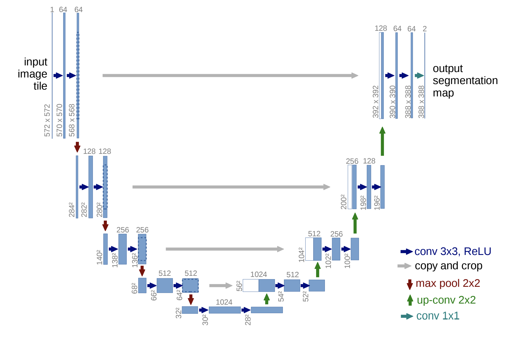
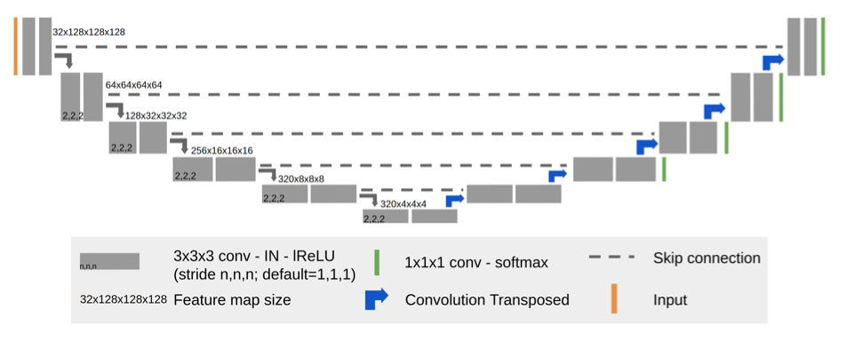

# BraTS3D

## 목적 및 설명

### 1. 목적
BraTS에 기본 UNet을 적용하는 Baseline보다 더 좋은 성능의 Deep-Learning Network 설계하고자 합니다.

### 2. 설계 방안
여러 방안을 연구했으나, 구현 난이도와 제한적인 Cost를 고려해서 지난 BraTS 대회에서 1등했던 nnUNet의 논문과 동일한 망 구조와 Parameter를 가지는 Deep-Learning Network를 재설계했습니다.

### 3. 기존 Network의 구조
    * 참고로 하기 그림은 2D UNet이나, 동일 형태 3차원의 FIlter를 사용하면 3D UNet이므로 아래 설명은 3D UNet 기준으로 설명하겠습니다.



- UNET의 망 구조는 위와 같으며, Encoder 부분에서 3 X 3 X 3 Convolution (stride 1)과 MaxPool (stride 2)를 함꼐 사용합니다.
- Baseline으로 주어진 Parameter 및 자원(Colab)의 한계로 돌릴 수 있는 Paramter는 아래와 같았습니다.
  1) Batch size : 1  (2로 할 경우는 Colab, RTX2070 환경에서 모두 Memory Overflow 발생)
  2) Depth : 4
  3) Learning rate : 0.0001
  4) Drop-out rate : 0.3
  5) 시작 Channel 수 : 4  (기존 구조의 경우 64)
    
- 위에 따라 설계된 Modeling 코드는 다음과 같습니다.
````
class Convolution(Module):
    def __init__(self,
                 nDimInput: int,
                 nDimOutput: int,
                 dRateDropout: float = 0.3):
        super(Convolution, self).__init__()
        self.network = torch.nn.Sequential(
            torch.nn.Conv3d(nDimInput, nDimOutput, kernel_size=3, padding=1, bias=False),
            torch.nn.InstanceNorm3d(nDimOutput),
            torch.nn.LeakyReLU(negative_slope=0.2, inplace=True),
            torch.nn.Dropout3d(dRateDropout),
            torch.nn.Conv3d(nDimOutput, nDimOutput, kernel_size=3, padding=1, bias=False),
            torch.nn.InstanceNorm3d(nDimOutput),
            torch.nn.LeakyReLU(negative_slope=0.2, inplace=True),
            torch.nn.Dropout3d(dRateDropout)
        )

    def forward(self, pTensorX: tensor):
        return self.network(pTensorX)


class UpSampler(Module):
    def __init__(self,
                 nDimInput: int,
                 nDimOutput: int):
        super(UpSampler, self).__init__()
        self.network = torch.nn.Sequential(
            torch.nn.ConvTranspose3d(nDimInput, nDimOutput, kernel_size=2, stride=2, bias=True),
            torch.nn.InstanceNorm3d(nDimOutput),
            torch.nn.LeakyReLU(negative_slope=0.2, inplace=True),
        )

    def forward(self, pTensorX: tensor):
        return self.network(pTensorX)


class UNet3D(Module):
    def __init__(self,
                 nDimInput: int,
                 nDimOutput: int,
                 nChannel: int,
                 nCountDepth: int,
                 dRateDropout: float = 0.3):
        super(UNet3D, self).__init__()
        # Init Encoders and Decoders
        self.encoders = torch.nn.ModuleList([Convolution(nDimInput, nChannel, dRateDropout)])
        for i in range(nCountDepth - 1):
            self.encoders += [Convolution(nChannel, nChannel * 2, dRateDropout)]
            nChannel *= 2
        self.down_sampler = torch.nn.AvgPool3d(kernel_size=2, stride=2, padding=0)
        self.worker = Convolution(nChannel, nChannel * 2, dRateDropout)
        self.decoders = torch.nn.ModuleList()
        self.up_samplers = torch.nn.ModuleList()
        for i in range(nCountDepth - 1):
            self.up_samplers += [UpSampler(nChannel * 2, nChannel)]
            self.decoders += [Convolution(nChannel * 2, nChannel, dRateDropout)]
            nChannel //= 2
        self.up_samplers += [UpSampler(nChannel * 2, nChannel)]
        self.decoders += [
            torch.nn.Sequential(
                Convolution(nChannel * 2, nChannel, dRateDropout),
                torch.nn.Conv3d(nChannel, nDimOutput, kernel_size=1, stride=1),
                torch.nn.Softmax(dim=1)
            )
        ]

    def __padding(self, pTensorX: tensor):
        def floor_ceil(n):
            return math.floor(n), math.ceil(n)

        nBatch, nFlag, nDensity, nHeight, nWidth = pTensorX.shape
        nWidthBitMargin = ((nWidth - 1) | 15) + 1  # 15 = (1111)
        nHeightBitMargin = ((nHeight - 1) | 15) + 1
        nDensityBitMargin = ((nDensity - 1) | 15) + 1
        pPadWidth = floor_ceil((nWidthBitMargin - nWidth) / 2)
        pPadHeight = floor_ceil((nHeightBitMargin - nHeight) / 2)
        pPadDensity = floor_ceil((nDensityBitMargin - nDensity) / 2)
        x = torch.nn.functional.pad(pTensorX, pPadWidth + pPadHeight + pPadDensity)
        return x, (pPadDensity, pPadHeight, pPadWidth, nDensityBitMargin, nHeightBitMargin, nWidthBitMargin)

    def __unpadding(self, x, pPadDensity, pPadHeight, pPadWidth, nDensityMargin, nHeightMargin, nWidthMargin):
        return x[..., pPadDensity[0]:nDensityMargin - pPadDensity[1], pPadHeight[0]:nHeightMargin - pPadHeight[1],
               pPadWidth[0]:nWidthMargin - pPadWidth[1]]

    def forward(self, pTensorX: tensor):
        pTensorX, pPadOption = self.__padding(pTensorX)
        pListStack = []
        pTensorResult = pTensorX
        # Apply down sampling layers
        for i, pEncoder in enumerate(self.encoders):
            pTensorResult = pEncoder(pTensorResult)
            pListStack.append(pTensorResult)
            pTensorResult = self.down_sampler(pTensorResult)
        pTensorResult = self.worker(pTensorResult)
        # Apply up sampling layers
        for pSampler, pDecoder in zip(self.up_samplers, self.decoders):
            pTensorAttached = pListStack.pop()
            pTensorResult = pSampler(pTensorResult)
            # Reflect pad on the right/botton if needed to handle odd input dimensions.
            pPadding = [0, 0, 0, 0]  # left, right, top, bottom
            if pTensorResult.shape[-1] != pTensorAttached.shape[-1]:
                pPadding[1] = 1  # Padding right
            if pTensorResult.shape[-2] != pTensorAttached.shape[-2]:
                pPadding[3] = 1  # Padding bottom
            if sum(pPadding) != 0:
                pTensorResult = torch.nn.functional.pad(pTensorResult, pPadding, "reflect")
            pTensorResult = torch.cat([pTensorResult, pTensorAttached], dim=1)
            pTensorResult = pDecoder(pTensorResult)
        pListStack.clear()  # To Memory Optimizing
        pTensorResult = self.__unpadding(pTensorResult, *pPadOption)
        return pTensorResult
````
   
### 4. nnUNet의 구조
기본적인 형태는 nnUNet과 동일하지만, Parameter와 사용 Model의 차이가 있습니다.
또한 구동 환경의 제한(Colab)으로 논문에서 제시한 Parameter와 완전히 동일한 것을 사용하진 못했습니다.



-  MaxPool을 사용하지 않고 Convolution의 Stride를 2로 함으로써 크기를 감소시킵니다.
- Decoder 단의 경우 2번의 Convolution 후 1차의 Convolution 및 Softmax 처리를 합니다.
- 구동 환경의 제한으로 Parameter 역시도 아래처럼 제한적으로 가져갔습니다.
  1) Batch size : 1
  2) Depth 4
  3) Learning rate : 0.01 (논문 제시)
  4) Drop-out rate : 0.3
  5) 시작 Channel 수 : 4  (기존 구조의 경우 32)
    
- nnUNet 논문에 따라 재설계한 Modeling은 아래와 같습니다.
  
````

class Convolution(Module):
    def __init__(self,
                 nDimInput: int,
                 nDimOutput: int,
                 dRateDropout: float = 0.3):
        super(Convolution, self).__init__()
        self.network = torch.nn.Sequential(
            torch.nn.Conv3d(nDimInput, nDimOutput, kernel_size=3, padding=1, bias=False),
            torch.nn.BatchNorm3d(nDimOutput),
            torch.nn.LeakyReLU(negative_slope=0.2, inplace=True),
            torch.nn.Dropout3d(dRateDropout),
            torch.nn.Conv3d(nDimOutput, nDimOutput, kernel_size=3, padding=1, bias=False),
            torch.nn.BatchNorm3d(nDimOutput),
            torch.nn.LeakyReLU(negative_slope=0.2, inplace=True),
            torch.nn.Dropout3d(dRateDropout)
        )

    def forward(self, pTensorX: tensor):
        return self.network(pTensorX)


class ConvolutionForEncoder(Module):
    def __init__(self,
                 nDimInput: int,
                 nDimOutput: int,
                 dRateDropout: float = 0.3):
        super(ConvolutionForEncoder, self).__init__()
        self.network = torch.nn.Sequential(
            # Down-sampling per 2 stride
            torch.nn.Conv3d(nDimInput, nDimOutput, kernel_size=3, stride=2, padding=0, bias=False),
            torch.nn.BatchNorm3d(nDimOutput),
            torch.nn.LeakyReLU(negative_slope=0.2, inplace=True),
            torch.nn.Dropout3d(dRateDropout),
            torch.nn.Conv3d(nDimOutput, nDimOutput, kernel_size=2, stride=1, padding=1, bias=False),
            torch.nn.BatchNorm3d(nDimOutput),
            torch.nn.LeakyReLU(negative_slope=0.2, inplace=True),
        )

    def forward(self, pTensorX: tensor):
        return self.network(pTensorX)


class ConvolutionForDecoder(Module):
    def __init__(self,
                 nDimInput: int,
                 nDimOutput: int,
                 dRateDropout: float = 0.3):
        super(ConvolutionForDecoder, self).__init__()
        self.network = torch.nn.Sequential(
            torch.nn.Conv3d(nDimInput, nDimOutput, kernel_size=3, padding=1, bias=False),
            torch.nn.BatchNorm3d(nDimOutput),
            torch.nn.LeakyReLU(negative_slope=0.2, inplace=True),
            torch.nn.Dropout3d(dRateDropout),
            torch.nn.Conv3d(nDimOutput, nDimOutput, kernel_size=3, padding=1, bias=False),
            torch.nn.BatchNorm3d(nDimOutput),
            torch.nn.LeakyReLU(negative_slope=0.2, inplace=True),
            torch.nn.Conv3d(nDimOutput, nDimOutput, kernel_size=1, stride=1),
            torch.nn.Softmax(dim=1)
        )

    def forward(self, pTensorX: tensor):
        return self.network(pTensorX)


class UpSampler(Module):
    def __init__(self,
                 nDimInput: int,
                 nDimOutput: int):
        super(UpSampler, self).__init__()
        self.network = torch.nn.Sequential(
            torch.nn.ConvTranspose3d(nDimInput, nDimOutput, kernel_size=2, stride=2, bias=True),
            torch.nn.BatchNorm3d(nDimOutput),
            torch.nn.LeakyReLU(negative_slope=0.2, inplace=True),
        )

    def forward(self, pTensorX: tensor):
        return self.network(pTensorX)


class nnUNet3D(Module):
    def __init__(self,
                 nDimInput: int,
                 nDimOutput: int,
                 nChannel: int,
                 nCountDepth: int,
                 dRateDropout: float = 0.3):
        super(nnUNet3D, self).__init__()
        # Init Encoders and Decoders
        self.encoders = torch.nn.ModuleList([Convolution(nDimInput, nChannel, dRateDropout)])
        # self.encoders has Encoder and Down-sampling (with stride)
        for i in range(nCountDepth - 1):
            self.encoders += [ConvolutionForEncoder(nChannel, nChannel * 2, dRateDropout)]
            nChannel *= 2
            # nnUNet Feature : static max channel in 320
        self.worker = ConvolutionForEncoder(nChannel, nChannel * 2, dRateDropout)
        self.decoders = torch.nn.ModuleList()
        self.up_samplers = torch.nn.ModuleList()
        for i in range(nCountDepth - 1):
            self.up_samplers += [UpSampler(nChannel * 2, nChannel)]
            self.decoders += [ConvolutionForDecoder(nChannel * 2, nChannel, dRateDropout)]
            nChannel //= 2
        self.up_samplers += [UpSampler(nChannel * 2, nChannel)]
        self.decoders += [
            torch.nn.Sequential(
                Convolution(nChannel * 2, nChannel, dRateDropout),
                torch.nn.Conv3d(nChannel, nDimOutput, kernel_size=1, stride=1),
                torch.nn.Softmax(dim=1)
            )
        ]

    def __padding(self, pTensorX: tensor):
        def floor_ceil(n):
            return math.floor(n), math.ceil(n)

        nBatch, nFlag, nDensity, nHeight, nWidth = pTensorX.shape
        nWidthBitMargin = ((nWidth - 1) | 15) + 1  # 15 = (1111)
        nHeightBitMargin = ((nHeight - 1) | 15) + 1
        nDensityBitMargin = ((nDensity - 1) | 15) + 1
        pPadWidth = floor_ceil((nWidthBitMargin - nWidth) / 2)
        pPadHeight = floor_ceil((nHeightBitMargin - nHeight) / 2)
        pPadDensity = floor_ceil((nDensityBitMargin - nDensity) / 2)
        x = torch.nn.functional.pad(pTensorX, pPadWidth + pPadHeight + pPadDensity)
        return x, (pPadDensity, pPadHeight, pPadWidth, nDensityBitMargin, nHeightBitMargin, nWidthBitMargin)

    def __unpadding(self, x, pPadDensity, pPadHeight, pPadWidth, nDensityMargin, nHeightMargin, nWidthMargin):
        return x[..., pPadDensity[0]:nDensityMargin - pPadDensity[1], pPadHeight[0]:nHeightMargin - pPadHeight[1],
               pPadWidth[0]:nWidthMargin - pPadWidth[1]]

    def forward(self, pTensorX: tensor):
        pTensorX, pPadOption = self.__padding(pTensorX)
        pListStack = []
        pTensorResult = pTensorX
        # Apply down sampling layers
        for i, pEncoder in enumerate(self.encoders):
            pTensorResult = pEncoder(pTensorResult)
            pListStack.append(pTensorResult)
        pTensorResult = self.worker(pTensorResult)
        # Apply up sampling layers
        for pSampler, pDecoder in zip(self.up_samplers, self.decoders):
            pTensorAttached = pListStack.pop()
            pTensorResult = pSampler(pTensorResult)
            # Reflect pad on the right/botton if needed to handle odd input dimensions.
            pPadding = [0, 0, 0, 0, 0, 0]  # left, right, top, bottom
            if pTensorResult.shape[-1] != pTensorAttached.shape[-1]:
                pPadding[1] = 1  # Padding right
            if pTensorResult.shape[-2] != pTensorAttached.shape[-2]:
                pPadding[3] = 1  # Padding bottom
            if pTensorResult.shape[-3] != pTensorAttached.shape[-3]:
                pPadding[5] = 1
            if sum(pPadding) != 0:
                pTensorResult = torch.nn.functional.pad(pTensorResult, pPadding, "replicate")
            pTensorResult = torch.cat([pTensorResult, pTensorAttached], dim=1)
            # To Fix the CUDA Memory overflow
            if torch.cuda.is_available():
                del pTensorAttached
                torch.cuda.empty_cache()
            pTensorResult = pDecoder(pTensorResult)
        pListStack.clear()  # To Memory Optimizing
        pTensorResult = self.__unpadding(pTensorResult, *pPadOption)
        return pTensorResult
````
- nnUNet을 설계한 후 BraTS 2020 Data를 Validation 해서 제출한 결과는 /result/Results-882041978798702490에 올려놨습니다.
   
   
5. 추가 개선
- nnUNet 논문에서는 Loss Function을 구하기 위해 기존(Dice Loss) 방식과 BCELoss를 결합하기 때문에 이것을 그대로 반영해서 코드를 추가했습니다.
- 기존 Baseline에서 가져온 Dice Loss를 사용한 결과 이상하게도 8 Epoch 이후 Loss가 변하지 않고 수렴하는 증상이 발견되었습니다. 
  이에 따라 Dice Loss 적용할 때 기존에 수치적인 계산으로 교집합을 구하지 않고,  numpy를 활용한 Logistic And로 교집합을 구하는 방식을 발견해서 이를 적용했습니다.   
- Learning Rate의 경우 nnUNet에서 0.01을 강조했으나, Learning rate가 너무 큰 경우  값 수렴이 잘 안되는 특성을 반영해 최적화 된 설계를 구하지 못하는 Epoch가 10회 반복되면 Loss를 반감되는 코드를 추가했습니다.
- 위 사항들을 적용한 Dice Loss 계산 방식은 다음과 같습니다.
````
def get_dice_coefficient(pTensorPredict: tensor,
                         pTensorTarget: tensor,
                         dSmooth=1e-4):
    pTensorPredict = pTensorPredict.contiguous().view(-1)
    pTensorTarget = pTensorTarget.contiguous().view(-1)
    pTensorPredict = pTensorPredict.detach().cpu().numpy().astype(numpy.bool)
    pTensorTarget = pTensorTarget.detach().cpu().numpy().astype(numpy.bool)
    pTensorIntersection = numpy.logical_and(pTensorPredict, pTensorTarget).sum()
    pTensorCoefficient = (2.0 * pTensorIntersection + dSmooth) / (pTensorPredict.sum() + pTensorTarget.sum() + dSmooth)
    return pTensorCoefficient
```` 
- Parameter는 다음과 같이 변화를 줬으며, 변화를 준 이유는 Comment로 적어놨습니다.
   1) Batch size : 1
   2) Depth : 4
   3) Learning rate : 0.01
      * 초기 Learning rate, 이후 학습 정도에 따라 반감됨
   4) Drop-out rate : 0.5
      * 부족한 Batch 및 Data 크기에서 무작위성을 증대하기 위해 Drop-out rate 증가
   - nnUNet을 위처럼 개선한 후 Validation 결과는 아래와 같습니다.
     (5/28일 기준, 현재 제출 후 Pending 중입니다)
     
## 준비사항

반드시 ROOT 위치에 하기 3개 폴더를 넣어주시고, 해당 폴더에 BraTS2020에서 받은 폴더들을 분류해서 넣어주세요.

````
#### - MICCAI_BraTS20_TrainingData
#### - MICCAI_BraTS20_TrainingData_Part
#### - MICCAI_BraTS20_ValidationData
````
#### 예를 들면 아래와 같습니다.
````
#####  BraTS20_Training_001 폴더부터 BraTS20_Training_300 폴더까지는 MICCAI_BraTS20_TrainingData 내 위치
#####  BraTS20_Training_301 폴더부터 BraTS20_Training_362 폴더까지는 MICCAI_BraTS20_TrainingData_Part 내 위치
#####  BraTS20_Validation_001 폴더부터 BraTS20_Validation_125 폴더까지는 MICCAI_BraTS20_ValidationData 내 위치
````


## 결과값 저장

결과값은 Result 폴더가 새로 생성된 후에 BraTS20_Validation_NNN.nii.gz 같은 이름으로 저장됩니다.

## 추가 설명
Colab에서 돌릴거면 ColabPyRunner_BraTs20.ipynb를 열고 경로를 수정한 다음에 돌리시면 됩니다.

Local 환경에서 그냥 돌리실거면 PyCharm 또는 VSCode 등의 IDE를 설정한 후에 nnunet이나 unet을 실행하셔도 되고,
CMD에서 python unet.py 이런 식으로 돌려도 됩니다.
(CUDA로 실행하려면 최소 VRAM 8GB 이상의 그래픽 카드 필요)


### 참고로 Windows 10, Linux, MacOS 에서 전부 돌아갑니다.
